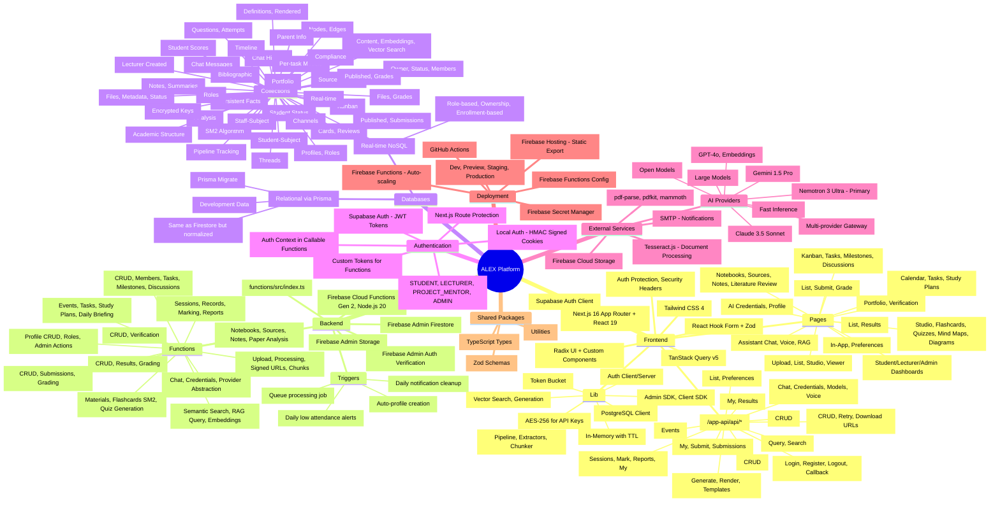

```mermaid
mindmap
  root((ALEX Platform))
    Frontend
      Framework[Next.js 16 App Router + React 19]
      Styling[Tailwind CSS 4]
      State[TanStack Query v5]
      Forms[React Hook Form + Zod]
      UI[Radix UI + Custom Components]
      Auth[Supabase Auth Client]
      Pages
        Dashboard[Student/Lecturer/Admin Dashboards]
        Documents[Upload, List, Studio, Viewer]
        AI[Assistant Chat, Voice, RAG]
        Study[Studio, Flashcards, Quizzes, Mind Maps, Diagrams]
        Planner[Calendar, Tasks, Study Plans]
        Research[Notebooks, Sources, Notes, Literature Review]
        Projects[Kanban, Tasks, Milestones, Discussions]
        Assignments[List, Submit, Grade]
        Assessments[List, Results]
        Achievements[Portfolio, Verification]
        Notifications[In-App, Preferences]
        Settings[AI Credentials, Profile]
      API Routes[/app-api/api/*]
        Auth[Login, Register, Logout, Callback]
        Documents[CRUD, Retry, Download URLs]
        AI[Chat, Credentials, Models, Voice]
        RAG[Query, Search]
        Assignments[My, Submit, Submissions]
        Assessments[My, Results]
        Attendance[Sessions, Mark, Reports, My]
        Planner[Events]
        Notifications[List, Preferences]
        Projects[CRUD]
        Achievements[CRUD]
        Diagrams[Generate, Render, Templates]
      Middleware[Auth Protection, Security Headers]
      Lib
        Prisma[PostgreSQL Client]
        Supabase[Auth Client/Server]
        Firebase[Admin SDK, Client SDK]
        Encryption[AES-256 for API Keys]
        RAG[Vector Search, Generation]
        Document Processing[Pipeline, Extractors, Chunker]
        Cache[In-Memory with TTL]
        Rate Limiter[Token Bucket]
    Backend
      Runtime[Firebase Cloud Functions Gen 2, Node.js 20]
      Entry Point[functions/src/index.ts]
      Functions
        User[Profile CRUD, Roles, Admin Actions]
        Document[Upload, Processing, Signed URLs, Chunks]
        RAG[Semantic Search, RAG Query, Embeddings]
        AI[Chat, Credentials, Provider Abstraction]
        Study[Materials, Flashcards SM2, Quiz Generation]
        Planner[Events, Tasks, Study Plans, Daily Briefing]
        Research[Notebooks, Sources, Notes, Paper Analysis]
        Project[CRUD, Members, Tasks, Milestones, Discussions]
        Attendance[Sessions, Records, Marking, Reports]
        Assessment[CRUD, Results, Grading]
        Assignment[CRUD, Submissions, Grading]
        Achievement[CRUD, Verification]
      Triggers
        onUserCreate[Auto-profile creation]
        onDocumentUpload[Queue processing job]
        scheduledCleanup[Daily notification cleanup]
        scheduledAttendanceAlerts[Daily low attendance alerts]
      Auth[Firebase Admin Auth Verification]
      DB Access[Firebase Admin Firestore]
      Storage[Firebase Admin Storage]
    Databases
      Firestore[Real-time NoSQL]
        Collections
          Users[Profiles, Roles]
          Documents[Files, Metadata, Status]
          DocumentChunks[Content, Embeddings, Vector Search]
          DocumentProcessingJobs[Pipeline Tracking]
          Conversations[Chat History]
          Messages[Chat Messages]
          UserMemories[Persistent Facts]
          StudyMaterials[Notes, Summaries]
          FlashcardDecks[SM2 Algorithm]
          Flashcards[Cards, Reviews]
          Quizzes[Questions, Attempts]
          MindMaps[Nodes, Edges]
          Diagrams[Definitions, Rendered]
          ResearchNotebooks[Sources, Notes]
          ResearchSources[Bibliographic]
          ResearchNotes[Analysis]
          Projects[Owner, Status, Members]
          ProjectMembers[Roles]
          ProjectTasks[Kanban]
          ProjectMilestones[Timeline]
          ProjectDiscussions[Threads]
          AttendanceSessions[Lecturer Created]
          AttendanceRecords[Student Status]
          Assessments[Published, Grades]
          AssessmentResults[Student Scores]
          Assignments[Published, Submissions]
          AssignmentSubmissions[Files, Grades]
          StudentAchievements[Portfolio]
          GuardianContacts[Parent Info]
          Notifications[Real-time]
          NotificationPreferences[Channels]
          AI_Credentials[Encrypted Keys]
          AI_ModelConfigs[Per-task Models]
          Institutions/Departments/Courses/Semesters[Academic Structure]
          SubjectEnrollments[Student-Subject]
          LecturerAssignments[Staff-Subject]
          AuditLogs[Compliance]
        Security Rules[Role-based, Ownership, Enrollment-based]
      PostgreSQL[Relational via Prisma]
        Models[Same as Firestore but normalized]
        Migrations[Prisma Migrate]
        Seed[Development Data]
    Authentication
      Primary[Supabase Auth - JWT Tokens]
      Fallback[Local Auth - HMAC Signed Cookies]
      Firebase[Custom Tokens for Functions]
      Roles[STUDENT, LECTURER, PROJECT_MENTOR, ADMIN]
      Middleware[Next.js Route Protection]
      Functions[Auth Context in Callable Functions]
    External Services
      AI Providers
        NVIDIA[Nemotron 3 Ultra - Primary]
        OpenAI[GPT-4o, Embeddings]
        Google[Gemini 1.5 Pro]
        Anthropic[Claude 3.5 Sonnet]
        Mistral[Large Models]
        Groq[Fast Inference]
        OpenRouter[Multi-provider Gateway]
        Together[Open Models]
      Storage[Firebase Cloud Storage]
      Email[SMTP - Notifications]
      OCR[Tesseract.js - Document Processing]
      PDF[pdf-parse, pdfkit, mammoth]
    Deployment
      Hosting[Firebase Hosting - Static Export]
      Functions[Firebase Functions - Auto-scaling]
      CI/CD[GitHub Actions]
      Environments[Dev, Preview, Staging, Production]
      Secrets[Firebase Secret Manager]
      Config[Firebase Functions Config]
    Shared Packages
      @alex/shared-types[TypeScript Types]
      @alex/shared-utils[Utilities]
      @alex/validation-schemas[Zod Schemas]
```